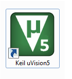

<h3 align="center">
  Welcome to Naem Azam's profile!
  
</h3>

<!-- Typing SVG  - https://readme-typing-svg.herokuapp.com/demo/ 
leetcode: https://leetcard.jacoblin.cool/ -->
<h2 align="center">
  
  </h2>
 
 <!-- platfrom -->
 

  
  &#8287;&#8287;&#8287;&#8287;&#8287;
   
  &#8287;&#8287;&#8287;&#8287;&#8287;
  
  &#8287;&#8287;&#8287;&#8287;&#8287;
  
  &#8287;&#8287;&#8287;&#8287;&#8287;
  
  &#8287;&#8287;&#8287;&#8287;&#8287;
  
  &#8287;&#8287;&#8287;&#8287;&#8287;
  
  &#8287;&#8287;&#8287;&#8287;&#8287;
  
  &#8287;&#8287;&#8287;&#8287;&#8287;
  

<!-- social -->
 

   
  &#8287;&#8287;&#8287;&#8287;&#8287;
  
  &#8287;&#8287;&#8287;&#8287;&#8287;
  
  &#8287;&#8287;&#8287;&#8287;&#8287;
  
  &#8287;&#8287;&#8287;&#8287;&#8287;
  
  &#8287;&#8287;&#8287;&#8287;&#8287;
  
  &#8287;&#8287;&#8287;&#8287;&#8287;
  
  &#8287;&#8287;&#8287;&#8287;&#8287;
  
  &#8287;&#8287;&#8287;&#8287;&#8287;
  

   
  
  
  

  
  </a>
  </a>
  </a>
  </a>
  
  
Hi, I'm [Naem Azam](http://naemazam.com/), a passionate self-taught Programmer, an open-source enthusiast, and a maintainer and National level hackathon winner🥇 🇨🇳. My passion for Systems lies in dreaming up ideas and making them come true with elegant interfaces. I take great care in the experience, architecture, and code quality of the things I build. I learned a lot from the open-source community and love how collaboration and knowledge sharing happened through open-source.

I’m a research scientist working to better understand About AI and Cybersecurity. My expertise includes Linux System Administration, IT Support Specialist, Web development, and implementation of AI research tools. I enjoy generating new ideas and devising feasible solutions to broadly relevant problems. My Friends would describe me as a driven, resourceful individual who maintains a positive, proactive attitude when faced with adversity. Currently, I’m seeking opportunities that will allow me to develop and promote technologies that benefit Companies. Specific fields of interest include Open-source Development, BlockChain, Networking, Linux OS Development, Digital forensics, System analysis, and Automotion.

I am also a freelancer and have been working online for more than 3 years. I have completed 200+ projects in my freelancing career. The most essential feature of me is that I am a reliable worker dedicating myself fully to my projects. Just handover your tasks to me and take a rest

  
  
  
  
- 🔭 I’m currently working on [Research Work](https://naemazam.github.io/Researcher/)

- 👨‍💻 All of my projects are available at [Projects](https://naemazam.github.io/My-Projects)

- 💬 Ask me about **Linux, Python,AI, CMD, PowerShell**

- 📄 Know about my [Experiences](https://naemazam.github.io/#resume)
- 👨‍💻 Hire Me as [Freelancer](http://naemazam.com/)

- ⚡ Fun fact **I Think I love my computer, more then myself.**

 # Research 
  
   <a
    id="cy-effective-orcid-url"
    class="underline"
     href="https://orcid.org/0009-0008-9398-3902"
     target="orcid.widget"
     rel="me noopener noreferrer"
     style="vertical-align: top">
     
      https://orcid.org/0009-0008-9398-3902
    </a>
    
 [Science Open ](https://www.scienceopen.com/user/naemazamchowdhury)
 

<h2 align="left" id="naemazam">Certificates</h2>

>Professional Certificates

<table>
  <tr>
    <td align="center" width="96">
      
       IT Support Proffetional
    </td>
    <td align="center" width="96">
      
       IT Automation with Python Professional
    </td>
    <td align="center" width="96">
      
       CompTIA Network+
    </td>
    <td align="center" width="96">
      
       Linux System Administration
    </td>
     </tr>
</table>

<h2 align="left" id="naemazam">Dev-Hub</h2>

> Progamming languages

<table>
  <tr>
    <td align="center" width="96">
      
       Bash
    </td>
    <td align="center" width="96">
      
       Python
    </td>
    <td align="center" width="96">
      
       C
    </td>
    <td align="center" width="96">
      
       C++
    </td>
    <td align="center" width="96">
      
       markdown
    </td>
     <td align="center" width="96">
      
       HTML
    </td>
     <td align="center" width="96">
      
       SQL
    </td>
  </tr>
  <tr>
    <td align="center" width="96">
      
       Powershell
    </td>
    <td align="center" width="96">
      
       PHP
    </td>
    </tr>
</table>

> Frameworks and libraries

<table>
  <tr>
    <td align="center" width="96">
      
       Arduino
    </td>
    <td align="center" width="96">
      
       bootstrap
    </td>
    <td align="center" width="96">
      
       flutter
    </td>
    <td align="center" width="96">
      
       React
    </td>
    <td align="center" width="96">
      
       GitHub-Action
    </td>
     <td align="center" width="96">
      
       Wordpress
    </td>
     <td align="center" width="96">
      
       Flask
    </td>
    <td align="center" width="96">
      
       QT
    </td>
    </tr>
</table>

> Databases and cloud hosting

<table>
  <tr>
    <td align="center" width="96">
      
       GitHub Page
    </td>
    <td align="center" width="96">
      
       my-sql
    </td>
    </tr>
</table>

> operating system

<table>
  <tr>
    <td align="center" width="96">
      
       Windows
    </td>
    <td align="center" width="96">
      
       Ret-Hat
    </td>
    <td align="center" width="96">
      
       Debian
    </td>
    <td align="center" width="96">
      
       Raspberry pi
    </td>
    <td align="center" width="96">
      
       kali
    </td>
    <td align="center" width="96">
      
       ARCH
    </td>
    <td align="center" width="96">
      
       android
    </td>
    <td align="center" width="96">
      
       Chrome OS
    </td>
    </tr>
</table>

> Software and tools
<table>
  <tr>
    <td align="center" width="96">
      
       nmap
    </td>
    <td align="center" width="96">
      
       Anaconda
    </td>
    <td align="center" width="96">
      
       Git
    </td>
     <td align="center" width="96">
      
       Proteus
    </td>
   <td align="center" width="96">
      
       Keil
    </td>
    <td align="center" width="96">
      
       wiershark
    </td>
    <td align="center" width="96">
      
       Visual Studio
    </td>
     <tr>
    <td align="center" width="96">
      
       Jupyter Notebook
    </td>
    <td align="center" width="96">
      
       Sublime
    </td>
    </tr>
</table>

<!-- table emd-->

<!-- project table -->
 

## 📘 My top  projects

 
 
 
 
 
 

  

  <h2> My Projects Box </h2>
  
  

  

  

<h2> Static Website Project </h2>
  <table> 
    <tr>
    <th> Project name </th>
     <th> Abstract </th>
     <th> GitHub Links </th>
     <th> Documentation Webpage </th>
    </tr>
  <tr>
    <td> Impossible-OS </td>
     <td> Everyone is saying make a OS by using Html CSS and js is not possible that's why I named it Impossible OS. But I Know You will Like IT. </td>
      <td>  <a href="https://github.com/naemazam/Impossible-OS#readme" target="blank"> ReadMe </a> </td>
          <td>  <a href="https://naemazam.github.io/Impossible-OS/" target="blank"> Visit </a> </td>
    </tr>
    <tr>
    <td> Minimal student portfolio </td>
     <td> A simple gift for my student </td>
    <td>  <a href="https://github.com/naemazam/Minimal-student-portfolio#readme" target="blank"> ReadMe </a> </td>
     <td> <a href="https://naemazam.github.io/Minimal-student-portfolio/" target="blank"> WebView </a> </td>
    </tr>
    <tr>
    <td> Font-End Dev Portfolio </td>
     <td> This portfolio Designer For Font-end Dev. A Simple gift for my Fellows </td>
    <td>  <a href="https://github.com/naemazam/Front-end-dev-portfolio#readme" target="blank"> ReadMe </a> </td>
     <td> <a href="https://naemazam.github.io/Front-end-dev-portfolio/" target="blank"> WebView </a> </td>
    </tr>
     <tr>
    <td> Google search clone </td>
     <td> Fully working fake Google search engine clone using html CSS and JS </td>
    <td>  <a href="https://github.com/naemazam/Google-search-clone#readme" target="blank"> ReadMe </a> </td>
     <td> <a href="https://naemazam.github.io/Google-search-clone/" target="blank"> WebView </a> </td>
    </tr>
    <tr>
    <td>My projects </td>
     <td>Let's See. In here I am Combining All of my projects and Works. </td>
    <td>  <a href="https://github.com/naemazam/My-Projects#readme" target="blank"> ReadMe </a> </td>
      <td>  <a href="https://naemazam.github.io/My-Projects/" target="blank"> WebView </a> </td>
    </tr>
  <tr>
    <td> About Me </td>
     <td>It's a Simple Card For Add About me any Of My projects.</td>
    <td>  <a href="https://github.com/naemazam/About-Me#readme" target="blank"> ReadMe </a> </td>
      <td>  <a href="https://naemazam.github.io/About-Me/" target="blank"> WebView </a> </td>
    </tr>
    <tr>
    <td> Ux/UI portfolio</td>
     <td>Fully Responsive UX/UI Portfolio Website Template </td>
    <td>  <a href="https://github.com/naemazam/UXUI-portfolio#readme" target="blank"> ReadMe </a> </td>
      <td>  <a href="https://naemazam.github.io/UXUI-portfolio/" target="blank"> DEMO </a> </td>
    </tr>
  <tr>
    <td> Animate-AutoTyping-Terminal-Portfolio</td>
     <td>Responsive Animated Autotyping terminal Portfolio Using HTML CSS And JavaScript </td>
    <td>  <a href="https://github.com/naemazam/Animate-AutoTyping-Terminal-Portfolio#readme" target="blank"> ReadMe </a> </td>
      <td>  <a href="https://naemazam.github.io/Animate-AutoTyping-Terminal-Portfolio/" target="blank"> DEMO </a> </td>
    </tr>
  <tr>
    <td> HTML CV</td>
     <td>Open-Source CV Website Collection by CV Baba </td>
    <td>  <a href="https://github.com/naemazam/Html-CV#readme" target="blank"> ReadMe </a> </td>
      <td>  <a href="https://github.com/naemazam/Html-CV" target="blank"> -</a> </td>
    </tr>
    <tr>
    <td> Technical Documentation Page</td>
     <td>Technical Documentation Page with html css js </td>
    <td>  <a href="https://github.com/naemazam/Technical-Documentation-Page#readme" target="blank"> ReadMe </a> </td>
      <td>  <a href="https://github.com/naemazam/Technical-Documentation-Page" target="blank"> -</a> </td>
    </tr>
    <tr>
    <td> Doctor-Portfolio</td>
     <td>Technical Documentation Page with html css js </td>
    <td>  <a href="https://github.com/naemazam/Doctor-Portfolio#readme" target="blank"> ReadMe </a> </td>
      <td>  <a href="https://github.com/naemazam/Doctor-Portfolio" target="blank"> -</a> </td>
    </tr>
    <tr>
    <td> CyberPunk Portfolio</td>
     <td>Make a Cyberpunk Personal Portfolio with HTML, CSS and Js </td>
    <td>  <a href="https://github.com/naemazam/CyberPunk-Portfolio#readme" target="blank"> ReadMe </a> </td>
      <td>  <a href="https://github.com/naemazam/CyberPunk-Portfolio" target="blank"> -</a> </td>
    </tr>
  
  
  
  
  
  </table>
  
  <h2>Simple Web Application </h2>
  <table> 
    <tr>
    <th> Project name </th>
     <th> Abstract </th>
     <th> GitHub Links </th>
     <th> Documentation Webpage </th>
    </tr>
  <tr>
    <td> Impossible-OS </td>
     <td> Everyone is saying make a OS by using Html CSS and js is not possible that's why I named it Impossible OS. But I Know You will Like IT. </td>
      <td>  <a href="https://github.com/naemazam/Impossible-OS#readme" target="blank"> ReadMe </a> </td>
          <td>  <a href="https://naemazam.github.io/Impossible-OS/" target="blank"> Visit </a> </td>
    </tr>
  <tr>
    <td> The Calculator </td>
     <td>Make some Online calculator in js Design with Soft UI </td>
     <td>  <a href="https://github.com/naemazam/The-Calculator#readme" target="blank"> ReadMe </a> </td>
      <td>  <a href="https://naemazam.github.io/The-Calculator/" target="blank"> WebView </a> </td>
    </tr>
  <tr>
    <td> Weather-website-live</td>
     <td>  The weather app also provides atmospheric pressure, weather conditions, visibility distance, relative humidity, precipitation in different unites, dew point, wind speed and direction, in addition to ten days in future and hourly weather forecast. </td>
     <td>  <a href="https://github.com/naemazam/Weather-website-live" target="blank"> ReadMe </a> </td>
      <td>  <a href="https://naemazam.github.io/Weather-website-live/" target="blank"> WebView </a> </td>
    </tr>
  <tr>
    <td> Online Live Editor </td>
     <td> A simple gift for my font-end Developer Friends, It's a Html CSS and JavaScript live editor With live demo </td>
    <td>  <a href="https://github.com/naemazam/Live-Code-Editor/#readme" target="blank"> ReadMe </a> </td>
     <td> <a href="https://naemazam.github.io/Live-Code-Editor/" target="blank"> WebView </a> </td>
    </tr>
   <tr>
    <td> Live Browser </td>
     <td> Fully working webbrowser clone using html CSS and JS </td>
    <td>  <a href="https://github.com/naemazam/Live-Browser#readme" target="blank"> ReadMe </a> </td>
     <td> <a href="https://naemazam.github.io/Live-Browser/" target="blank"> WebView </a> </td>
    </tr>
  <tr>
    <td> Random Quran Ayat </td>
     <td> This Website will Generate Random Quran Ayat With Arabic and English Meaning. You can also share it on twitter or Facebook. </td>
    <td>  <a href="https://github.com/naemazam/Random-Quran-Ayat#readme" target="blank"> ReadMe </a> </td>
     <td> <a href="https://naemazam.github.io/Random-Quran-Ayat/" target="blank"> WebView </a> </td>
    </tr>
  <tr>
    <td> ReadMe Genarator </td>
     <td> Genarate Your Readme File Easyly make a Beautiful Design </td>
    <td>  <a href="https://github.com/naemazam/github-profile-readme-genarator#readme" target="blank"> ReadMe </a> </td>
     <td> <a href="https://naemazam.github.io/github-profile-readme-genarator/" target="blank"> WebView </a> </td>
    </tr>
  <tr>
    <td> text-to-speak </td>
     <td>Natural Reader is a professional text to speech program that converts any written text into spoken words. </td>
    <td>  <a href="https://github.com/naemazam/text-to-speak#readme" target="blank"> ReadMe </a> </td>
      <td>  <a href="https://naemazam.github.io/text-to-speak/" target="blank"> WebView </a> </td>
    </tr>
  <tr>
    <td>Type Beast </td>
     <td>A simple typing speed test Website based on html and js </td>
    <td>  <a href="https://github.com/naemazam/TypeBeast#readme" target="blank"> ReadMe </a> </td>
      <td>  <a href="https://naemazam.github.io/TypeBeast/" target="blank"> WebView </a> </td>
    </tr>
  <tr>
    <td>To Do List </td>
     <td>A simple Log In based To Do App </td>
    <td>  <a href="https://github.com/naemazam/To-Do-List#readme" target="blank"> ReadMe </a> </td>
      <td>  <a href="https://naemazam.github.io/To-Do-List/" target="blank"> WebView </a> </td>
    </tr>
  <tr>
    <td> Birthday Calender</td>
     <td>A Simple Birthday calender with evo-event calender</td>
    <td>  <a href="https://github.com/naemazam/Birthday-Calender#readme" target="blank"> ReadMe </a> </td>
      <td>  <a href="https://naemazam.github.io/Birthday-Calender/" target="blank"> WebView </a> </td>
    </tr>
  <tr>
    <td> I know your keybord</td>
     <td>I-know-your-keybord a web App for track every key value of your keybord </td>
    <td>  <a href="https://github.com/naemazam/I-know-your-keybordr#readme" target="blank"> ReadMe </a> </td>
      <td>  <a href="https://naemazam.github.io/I-know-your-keybord/" target="blank"> WebView </a> </td>
    </tr>
  <tr>
    <td> Dictionary App</td>
     <td>Dictionary-App a web App for search words on online via API </td>
    <td>  <a href="https://github.com/naemazam/Dictionary-App#readme" target="blank"> ReadMe </a> </td>
      <td>  <a href="https://naemazam.github.io/Dictionary-App" target="blank"> WebView </a> </td>
    </tr>
  <tr>
    <td> Note-Keeper</td>
     <td>in Note keeper app you can save, edit and delete your notes. It's have also Search feature and No one can see Your notes. </td>
    <td>  <a href="https://github.com/naemazam/Note-Keeper#readme" target="blank"> ReadMe </a> </td>
      <td>  <a href="https://naemazam.github.io/Note-Keeper/" target="blank"> WebView </a> </td>
    </tr>
  <tr>
    <td> Simple-Loan-Calculator</td>
     <td>Loan Calculator allows the users to calculate their loan monthly payment amount, total payable amount, and total interest. </td>
    <td>  <a href="https://github.com/naemazam/Simple-Loan-Calculator#readme" target="blank"> ReadMe </a> </td>
      <td>  <a href="https://naemazam.github.io/Simple-Loan-Calculator/" target="blank"> WebView </a> </td>
    </tr>
  <tr>
    <td> Online Timer and Alarm Clock</td>
     <td>Simple Html css and Js Based Web-App Where You Can set Alarm And Timer. </td>
    <td>  <a href="https://github.com/naemazam/Online-Timer-and-Alarm-Clock#readme" target="blank"> ReadMe </a> </td>
      <td>  <a href="https://naemazam.github.io/Online-Timer-and-Alarm-Clock/" target="blank"> DEMO </a> </td>
    </tr>
  <tr>
    <td> Advance password strength checker</td>
     <td>Create a password strength checker with javascript to check how strong and secure your password is. </td>
    <td>  <a href="https://github.com/naemazam/Advance-password-strength-checker#readme" target="blank"> ReadMe </a> </td>
      <td>  <a href="https://naemazam.github.io/Advance-password-strength-checker/" target="blank"> DEMO </a> </td>
    </tr>
  <tr>
    <td> PyScript Based Simple To Do App</td>
     <td>simple PyScript Based Simple To Do App </td>
    <td>  <a href="https://github.com/naemazam/PyScript-TODO#readme" target="blank"> ReadMe </a> </td>
      <td>  <a href="https://naemazam.github.io/PyScript-TODO/" target="blank"> DEMO </a> </td>
    </tr>
  <tr>
    <td> Registration-App-with-Export-to-CSV</td>
     <td>simple PyScript Based Simple To Do App </td>
    <td>  <a href="https://github.com/naemazam/Registration-App-with-Export-to-CSV#readme" target="blank"> ReadMe </a> </td>
      <td>  <a href="https://naemazam.github.io/Registration-App-with-Export-to-CSV/" target="blank"> DEMO </a> </td>
    </tr>
  
  
  
  </table>
  
  <h2>Advance Web Application </h2>
  <table> 
    <tr>
    <th> Project name </th>
     <th> Abstract </th>
     <th> GitHub Links </th>
     <th> Documentation Webpage </th>
    </tr>
  <tr>
    <td> Login Signup Form with Email Verification </td>
     <td>Login Signup Form with Email Verification is a Working PHP based Sine Up from with Working OTP generating System, It's Working On Local Host. And I told You How to Configure Server. </td>
    <td>  <a href="https://github.com/naemazam/Login-Signup-Form-with-Email-Verification#readme" target="blank"> ReadMe </a> </td>
      <td>  <a href="https://dev.to/naemazam/how-to-configure-xampp-to-send-mail-from-localhost-in-php--382c" target="blank"> Read Blog </a> </td>
    </tr>
  <tr>
    <td> Contact Form mail server</td>
     <td>This is a Simple Website's Contact Form Page developed in PHP and SQLite Database</td>
    <td>  <a href="https://github.com/naemazam/Contact-Form-mail-server#readme" target="blank"> ReadMe </a> </td>
      <td>  <a href="" target="blank"> -</a> </td>
    </tr>
   <tr>
    <td> CQUPT Online Thesis Archiving System</td>
     <td>This is a web-based application that provides an online platform for storing the students' thesis or capstone projects.developed in PHP and SQL Database</td>
    <td>  <a href="https://github.com/naemazam/Online-Thesis-Archiving-System#readme" target="blank"> ReadMe </a> </td>
      <td>  <a href="" target="blank"> -</a> </td>
    </tr>
     <tr>
    <td> Methuen Online Food Ordering System</td>
     <td>Online Food Ordering System like Uber eat, Food panda or Methuen made by Php and MySql</td>
    <td>  <a href="https://github.com/naemazam/Methuen-Online-Food-Ordering-System" target="blank"> ReadMe </a> </td>
      <td>  <a href="" target="blank"> Demo</a> </td>
    </tr>
    <tr>
    <td> Dynamic Portfolio Website With AdminPanel</td>
     <td>Online Food Ordering System like Uber eat, Food panda or Methuen made by Php and MySql</td>
    <td>  <a href="https://github.com/naemazam/dynamic-portfolio-website-with-Admin-Panel-php-mysql" target="blank"> ReadMe </a> </td>
      <td>  <a href="" target="blank"> Demo</a> </td>
    </tr>
  
  
  </table>
  
  <h2>Console Based application </h2>
  <table> 
    <tr>
    <th> Project name </th>
     <th> Abstract </th>
     <th> GitHub Links </th>
     <th> Language </th>
    </tr>
  <tr>
    <td> Student Record Book</td>
     <td>C based system can help you manage the list of the student records by entering information such as Name, Age , Mark, etc.</td>
    <td>  <a href="https://github.com/naemazam/Student-Record-Book#readme" target="blank"> ReadMe </a> </td>
      <td>  <a href="" target="blank"> -</a> </td>
    </tr>
   <tr>
    <td> Base Converter</td>
     <td>The Base converter is a simple project developed using c++ programming language. The project contains a base conversion system. The user can enter any number and convert them to any number system (like decimal to binary, binary to Hexadecimal, etc.).</td>
    <td>  <a href="https://github.com/naemazam/Base-Converter#readme" target="blank"> ReadMe </a> </td>
      <td>  <a href="" target="blank"> -</a> </td>
    </tr>
  <tr>
    <td> Hotel Management System</td>
     <td>Password Protected Hotel Management System in C language.</td>
    <td>  <a href="https://github.com/naemazam/Hotel-Management-System#readme" target="blank"> ReadMe </a> </td>
      <td>  <a href="" target="blank"> -</a> </td>
    </tr>
  <tr>
    <td> Canteen Management System</td>
     <td>The owner can add the employee and update the employee details. Similarly, the employee manages the sales and order.in c language</td>
    <td>  <a href="https://github.com/naemazam/Simple-Canteen-Management-System#readme" target="blank"> ReadMe </a> </td>
      <td>  <a href="youtu.be/g8xe20n8gbw" target="blank"> video</a> </td>
    </tr>
  <tr>
    <td> Library Management System</td>
     <td>Library Management System is specially designed for purpose of adding book’s records in a library. written By C language</td>
    <td>  <a href="https://github.com/naemazam/Library-Management-System#readme" target="blank"> ReadMe </a> </td>
      <td>  <a href="https://youtu.be/am89efdh99Y" target="blank"> video</a> </td>
    </tr>
  <tr>
    <td> Pizza-Ordering-System</td>
     <td>The Simple Pizza Ordering System was built in a simple console application. written By C++anguage</td>
    <td>  <a href="https://github.com/naemazam/Pizza-Ordering-System#readme" target="blank"> ReadMe </a> </td>
      <td>  <a href="" target="blank"> video</a> </td>
    </tr>
  <tr>
    <td> Fortune-Teller</td>
     <td>This Project is a console application, designed to determine the horoscope and predict future based on your Date of Birth, name entered written By C++anguage</td>
    <td>  <a href="https://github.com/naemazam/Fortune-Teller#readme" target="blank"> ReadMe </a> </td>
      <td>  <a href="https://www.youtube.com/watch?v=5wq47XCdrc8&feature=youtu.be" target="blank"> video</a> </td>
    </tr>
  <tr>
    <td> Tic-Tac-Toe-Game-using-C</td>
     <td>a simple windowed console application, that display the gameplay as a console log images. written By C++anguage</td>
    <td>  <a href="https://github.com/naemazam/Tic-Tac-Toe-Game-using-C#readme" target="blank"> ReadMe </a> </td>
      <td>  <a href="https://www.youtube.com/watch?v=VnHFShLb4NY&feature=youtu.be" target="blank"> video</a> </td>
    </tr>
  
  
  
  </table>
  
  <h2> Software GUI Project </h2>
  <table> 
    <tr>
    <th> Project name </th>
     <th> Abstract </th>
     <th> GitHub Links </th>
     <th> Documentation Webpage </th>
    </tr>
  <tr>
    <td> Python Module Managment </td>
     <td>It is a Free GUI App that helps you to Manage Your Python Module Management. Easy to Install and Use. </td>
      <td>  <a href="https://github.com/naemazam/PMM#readme" target="blank"> ReadMe </a> </td>
      <td>  <a href="https://www.youtube.com/watch?v=gW9cXDNlrsw" target="blank"> DEMO Video </a> </td>
    </tr>
  <tr>
    <td> Link Manager </td>
     <td>Link Manager is full-blown utility not only for storing URL but also for finding the ones you want quick and with little effort as well as grab them from a specific web address. </td>
      <td>  <a href="https://github.com/naemazam/Link-Manager#readme" target="blank"> ReadMe </a> </td>
      <td>  <a href="" target="blank"> - </a> </td>
    </tr>
   <tr>
    <td> Port-Finder </td>
     <td> A port scanner is an application designed to probe a server or host for open ports. </td>
      <td>  <a href="https://github.com/naemazam/port-finder#readme" target="blank"> ReadMe </a> </td>
      <td>  <a href="https://naemazam.github.io/port-finder/" target="blank"> WebView </a> </td>
    </tr>
  <tr>
    <td> 3a5y terminal </td>
     <td> C progamming Based Problem Solving Terminal </td>
    <td>  <a href="https://github.com/naemazam/3a5y-terminal#readme" target="blank"> ReadMe </a> </td>
      <td>  <a href="https://naemazam.github.io/3a5y-terminal/" target="blank"> WebView </a> </td>
    </tr>
  <tr>
    <td> Student-Information-System </td>
     <td> A student information system, student management system, school administration software or student administration system is a management information system for education establishments used to manage student data</td>
     <td>  <a href="https://github.com/naemazam/Student-Information-System#readme" target="blank"> ReadMe </a> </td>
      <td>  <a href="https://naemazam.github.io/Student-Information-System/" target="blank"> WebView </a> </td>
    </tr>
  <tr>
    <td> Subnet calculator </td>
     <td> A Subnet calculator based On Java </td>
    <td>  <a href="https://github.com/naemazam/SubNet-Calculator#readme" target="blank"> ReadMe </a> </td>
      <td>  - </td>
    </tr>
   <tr>
    <td>Local-File-Finder </td>
     <td>You can think of it as Google for your local files.</td>
    <td>  <a href="https://github.com/naemazam/Local-File-Finder#readme" target="blank"> ReadMe </a> </td>
      <td>  <a href="https://naemazam.github.io/Local-File-Finder/" target="blank"> WebView </a> </td>
    </tr>
  <tr>
    <td> Remember Password</td>
     <td>R-Pass is a Python GUI based Password Store and Generator System , Save,Easy And Useful.</td>
    <td>  <a href="https://github.com/naemazam/Remember-Password#readme" target="blank"> ReadMe </a> </td>
      <td>  <a href="" target="blank"> -</a> </td>
    </tr>
  <tr>
    <td> NA Paint</td>
     <td>A simple Python GUI Based Project You can Do Arts. Have Brush, eraser, pen, RGB colors. You can Change pen Sizes.</td>
    <td>  <a href="https://github.com/naemazam/Paint#readme" target="blank"> ReadMe </a> </td>
      <td>  <a href="" target="blank"> -</a> </td>
    </tr>
   <tr>
    <td> Youtube video Downloader</td>
     <td>Python based Youtube video Downloader GUI Application.</td>
    <td>  <a href="https://github.com/naemazam/Youtube-video-Downloader#readme" target="blank"> ReadMe </a> </td>
      <td>  <a href="" target="blank"> -</a> </td>
    </tr>
  <tr>
    <td> Number Base Converter App</td>
     <td>Python based Number Base Converter App GUI Application.</td>
    <td>  <a href="https://github.com/naemazam/Number-Base-Converter-App#readme" target="blank"> ReadMe </a> </td>
      <td>  <a href="" target="blank"> -</a> </td>
    </tr>
  
  
  
  
  
  
  </table>
  
  
  
  <h2> Research-based Project </h2>
  <table> 
    <tr>
    <th> Project name </th>
     <th> Abstract </th>
     <th> GitHub Links </th>
     <th> Documentation Webpage </th>
    </tr>
  <tr>
    <td> The-Evolution-of-Linux </td>
     <td> In this project, you'll be challenged to read in, clean up and visualize a real world Git repository dataset of the Linux kernel. </td>
    <td>  <a href="https://github.com/naemazam/The-Evolution-of-Linux#readme" target="blank"> ReadMe </a> </td>
     <td> <a href="https://naemazam.github.io/The-Evolution-of-Linux/" target="blank"> WebView </a> </td>
    </tr>
  <tr>
    <td> Predicting-Credit-Card-Approvals </td>
     <td> I will build an automatic credit card approval predictor using machine learning techniques, just like the real banks do. </td>
    <td>  <a href="https://github.com/naemazam/Predicting-Credit-Card-Approvals#readme" target="blank"> ReadMe </a> </td>
      <td>  <a href="#" target="blank"> WebView </a> </td>
    </tr>
  <tr>
    <td> Generating-Keywords-for-Google-Ads </td>
     <td> Automatically generate keywords for a search engine marketing campaign using Python. </td>
    <td>  <a href="https://github.com/naemazam/Generating-Keywords-for-Google-Ads#readme" target="blank"> ReadMe </a> </td>
      <td>  <a href="#" target="blank"> WebView </a> </td>
    </tr>
  <tr>
    <td> Gender-Prediction-using-Sound </td>
     <td>  I will use the Python package Fuzzy to find out the genders of authors that have appeared in the New York Times Best Seller list for Children's Picture books.</td>
    <td>  <a href="https://github.com/naemazam/Gender-Prediction-using-Sound#readme" target="blank"> ReadMe </a> </td>
      <td>  <a href="https://naemazam.github.io/Gender-Prediction-using-Sound/" target="blank"> WebView </a> </td>
    </tr>
  <tr>
    <td> Exploring-the-Bitcoin-Cryptocurrency-Market </td>
     <td> To better understand the growth and impact of Bitcoin and other cryptocurrencies you will, in this project, explore the market capitalization of different cryptocurrencies. </td>
    <td>  <a href="https://github.com/naemazam/Exploring-the-Bitcoin-Cryptocurrency-Market#readme" target="blank"> ReadMe </a> </td>
      <td>  <a href="#" target="blank"> WebView </a> </td>
    </tr>
  <tr>
    <td> A-Network-Analysis-of-Game-of-Thrones </td>
     <td> You will look at how the importance of the characters changes over the books using different centrality measures.</td>
    <td>  <a href="https://github.com/naemazam/A-Network-Analysis-of-Game-of-Thrones#readme" target="blank"> ReadMe </a> </td>
      <td>  <a href="#" target="blank"> WebView </a> </td>
    </tr>
  <tr>
    <td> Visualizing-COVID-19 </td>
     <td> we will visualize data from the early months of the coronavirus outbreak to see how this virus grew to be a global pandemic.</td>
    <td>  <a href="https://github.com/naemazam/Visualizing-COVID-19#readme" target="blank"> ReadMe </a> </td>
      <td>  <a href="#" target="blank"> WebView </a> </td>
    </tr>
  <tr>
    <td>The World Bank's international debt data </td>
     <td> It's not that we humans only take debts to manage our necessities. A country may also take debt to manage its economy.</td>
    <td>  <a href="https://github.com/naemazam/Analyze-International-Debt-Statistics#readme" target="blank"> ReadMe </a> </td>
      <td>  <a href="#" target="blank"> WebView </a> </td>
    </tr>
  <tr>
    <td>System-Administration-Consultation </td>
     <td>Use the systems administration concepts you learned in the course to provide technical improvements to current processes.</td>
    <td>  <a href="https://github.com/naemazam/System-Administration-Consultation" target="blank"> ReadMe </a> </td>
      <td>  <a href="https://naemazam.github.io/System-Administration-Consultation/" target="blank"> WebView </a> </td>
    </tr>
  <tr>
    <td> Earthquakes worldwide</td>
     <td>Earthquakes worldwide is a python based Earthquakes Data colection Code, It will show last 24 Hours World  recored </td>
    <td>  <a href="https://github.com/naemazam/Earthquakes-worldwide#readme" target="blank"> ReadMe </a> </td>
      <td>  <a href="" target="blank"> -</a> </td>
    </tr>
  <tr>
    <tr>
    <td> Brute Force</td>
     <td>Understand Brute Force Password attack</td>
    <td>  <a href="https://github.com/naemazam/Earthquakes-worldwide#readme" target="blank"> ReadMe </a> </td>
      <td>  <a href="" target="blank"> -</a> </td>
    </tr>
  <tr>
    <td> Minimal Block</td>
     <td>Blockchain is essentially a chain of blocks, and the connection is made by storing the hash of the previous block. Therefore, a chain can be implemented using a Python.</td>
    <td>  <a href="https://github.com/naemazam/Minimal-Blockchain#readme" target="blank"> ReadMe </a> </td>
      <td>  <a href="" target="blank"> -</a> </td>
    </tr>
  <tr>
    <td> Unix-Epochalypse</td>
     <td>Unix Epochalypse or The Year 2038 problem (also known as Y2038, Y2K38, or the Epochalypse) is a time formatting bug in computer systems with representing times after 03:14:07 UTC on 19 January 2038.</td>
    <td>  <a href="https://github.com/naemazam/Unix-Epochalypse#readme" target="blank"> ReadMe </a> </td>
      <td>  <a href="https://naemazam.github.io/Unix-Epochalypse/" target="blank"> Timer</td>
    </tr>
  <tr>
    <td> Real time face recognition Using Facenete</td>
     <td>Real time face recognition Using Facenet , pytorch, Tensorflow</td>
    <td>  <a href="https://github.com/naemazam/Real-time-face-recognition-Using-Facenet#readme" target="blank"> ReadMe </a> </td>
      <td>  <a href="#" target="blank"> Thesis</td>
    </tr>
  
  
  
  
  
  
  </table>
  
  <h2> Simple Game Project </h2>
  <table> 
    <tr>
    <th> Project name </th>
     <th> Abstract </th>
     <th> GitHub Links </th>
     <th> Live Play </th>
    </tr>
   <tr>
    <td> Chrome-Dinosaur </td>
     <td>simple chrome offline T-rex Runner game clone using html CSS and JS </td>
    <td>  <a href="https://github.com/naemazam/Chrome-Dinosaur#readme" target="blank"> ReadMe </a> </td>
      <td>  <a href="https://naemazam.github.io/Chrome-Dinosaur/" target="blank"> Play </a> </td>
    </tr>
  <tr>
    <td> Online Chess </td>
     <td>Online Chess game using html CSS and JS </td>
    <td>  <a href="https://github.com/naemazam/Online-Chess#readme" target="blank"> ReadMe </a> </td>
      <td>  <a href="https://naemazam.github.io/Online-Chess/" target="blank"> play </a> </td>
    </tr>
  <tr>
    <td> Basketball</td>
     <td>Online Basketball game using html CSS and JS </td>
    <td>  <a href="https://github.com/naemazam/Basketball-Game#readme" target="blank"> ReadMe </a> </td>
      <td>  <a href="https://naemazam.github.io/Basketball-Game/" target="blank"> play </a> </td>
    </tr>
  <tr>
    <td> Stick Hero</td>
     <td>Online Stick Hero game using html CSS and JS </td>
    <td>  <a href="https://github.com/naemazam/Stick-Hero#readme" target="blank"> ReadMe </a> </td>
      <td>  <a href="https://naemazam.github.io/Stick-Hero/" target="blank"> play </a> </td>
    </tr>
  <tr>
    <td>Online Ludo </td>
     <td>4 Play online ludo game on JS based </td>
    <td>  <a href="https://github.com/naemazam/Online-Ludo#readme" target="blank"> ReadMe </a> </td>
      <td>  <a href="https://naemazam.github.io/Online-Ludo/" target="blank"> WebView </a> </td>
    </tr>
  <tr>
    <td>tic-tac-toe Simple VS AI </td>
     <td>tictac-toe with AI </td>
    <td>  <a href="https://github.com/naemazam/tic-tac-toe-Simple-VS-AI#readme" target="blank"> ReadMe </a> </td>
      <td>  <a href="https://naemazam.github.io/tic-tac-toe-Simple-VS-AI/" target="blank"> Play </a> </td>
    </tr>
  <tr>
    <td>Fruit Ninja Game</td>
     <td>Fruit Ninja Game made with Js
    <td>  <a href="https://github.com/naemazam/Fruit-Ninja-Game#readme" target="blank"> ReadMe </a> </td>
      <td>  <a href="https://naemazam.github.io/Fruit-Ninja-Game/" target="blank"> Play </a> </td>
    </tr>
  
  
  
  </table>
  

  
  <h2> Script </h2>
  <table> 
    <tr>
    <th> Project name </th>
     <th> Abstract </th>
     <th> GitHub Links </th>
     <th> Language </th>
    </tr>
  <tr>
    <td> Hello World </td>
     <td> I don't Know What is Your First Language and Don't Want to know Why You Select it. But As a Programmer i know, The Smile When You run Your First Code. After That We made Thousands of Mistake In our DEV life. We did Debug, Copycat or Googling But never Forget This First 2 Words. Let's Combine Our First Happiness In A single Page. </td>
      <td>  <a href="https://github.com/naemazam/Hello-World#readme" target="blank"> ReadMe </a> </td>
          <td>  <a href="" target="blank"> - </a> </td>
    </tr>
   <tr>
    <td>Text to Morse</td>
     <td>Convert Text to Morse Code With Python</td>
    <td>  <a href="https://github.com/naemazam/Text-to-morse#readme" target="blank"> ReadMe </a> </td>
      <td>  Python </td>
    </tr>
  <tr>
    <td>Seven segment printer</td>
     <td>print Like 7-seg LED display</td>
    <td>  <a href="https://github.com/naemazam/Seven-segment-printer#readme" target="blank"> ReadMe </a> </td>
      <td> Python </td>
    </tr>
  <tr>
    <td>Word to Binary Convert</td>
     <td>Convert Your Loveletter to Binary</td>
    <td>  <a href="https://github.com/naemazam/Word-to-Binary-Convert#readme" target="blank"> ReadMe </a> </td>
      <td> C </td>
    </tr>
  <tr>
    <td>Roman to Decimal converter</td>
     <td>Python based Roman to Decimal converter</td>
    <td>  <a href="https://github.com/naemazam/Roman-to-Decimal-converter#readme" target="blank"> ReadMe </a> </td>
      <td> Python </td>
    </tr>
  <tr>
    <td>C-Syntax-Tracker</td>
     <td>This program will read another ( .cpp ) file and gives a complete information about the code in that file</td>
    <td>  <a href="https://github.com/naemazam/C-Syntax-Tracker#readme" target="blank"> ReadMe </a> </td>
      <td> C++ </td>
    </tr>
  <tr>
  <td> Periodic table</td>
     <td>Let's Gather Periodic table Information By python</td>
    <td>  <a href="https://github.com/naemazam/Periodic-table#readme" target="blank"> ReadMe </a> </td>
      <td>  <a href="" target="blank"> python</a> </td>
  </tr>
  </table>
  
  
  

  <h1 align="center">Summary Of My Github Status</h1>

  
 

 

  

<table align="center" border="1">
<tr align="center">
<td colspan="3"></td>
</tr>
<tr align="center">
<td></td>
<td></td>
<td colspan="3"></td>
</tr>
<tr align="center">
<td colspan="3"></td>
</tr>
<tr align="center">
<td colspan="3"></td>
</tr>
</table>
  

  

  
 

  <h1 align="center">Summary Of My Github Live Graph</h1>

  

